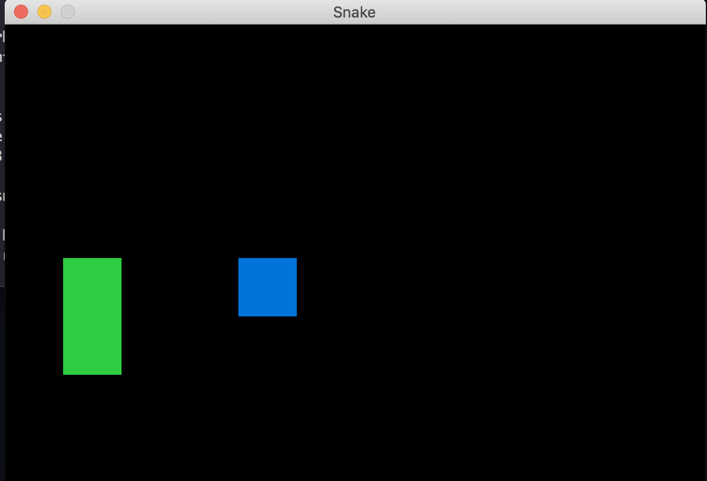

# Classic Snake Game made in Ruby

Snake Game made with Ruby to learn language basics

## How does it works?

Ruby required

* `bundle install` to install dependencies
* `bundle exec ruby src/app.rb` to start game
* `bundle exec ruby test/actions_test.rb` to run tests

## Licended

MIT